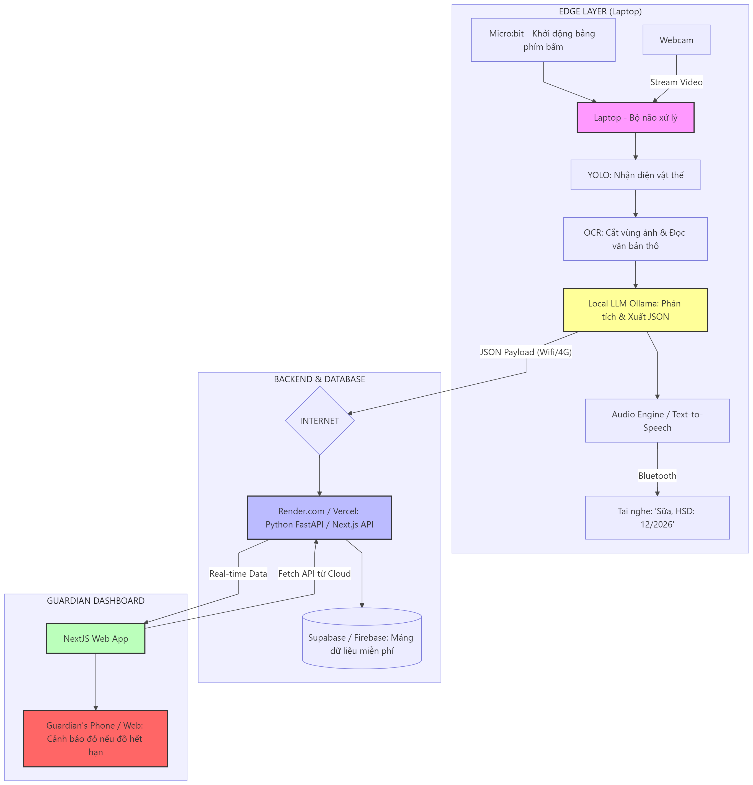

# 🛒 Shopping Assistant cho Người Khiếm thị

Hệ thống AI đa phương thức hỗ trợ người khiếm thị mua sắm độc lập bằng cách nhận diện sản phẩm, đọc hạn sử dụng, giá tiền và thông báo qua giọng nói.



---

## 🏗 Kiến trúc hệ thống

```
┌─────────────────────────────────────────────────────────────────┐
│                    EDGE LAYER (Raspberry Pi 5)                  │
├─────────────────────────────────────────────────────────────────┤
│                                                                 │
│  [Webcam] → [YOLO Detection] → [OCR] → [LLM] → [TTS] → [Audio] │
│                              ↓                                  │
│                        [Backend API] → [Database]               │
│                              ↓                                  │
│                    [WebSocket Realtime]                         │
└─────────────────────────────────────────────────────────────────┘
                              │
                              │ WiFi/4G
                              ↓
┌─────────────────────────────────────────────────────────────────┐
│                  CLOUD LAYER (Render/Vercel)                    │
├─────────────────────────────────────────────────────────────────┤
│  [Guardian Dashboard] ←→ [API Gateway] ←→ [Supabase/Firebase]  │
└─────────────────────────────────────────────────────────────────┘
```

---

## 📁 Cấu trúc repository (Monorepo)

```
shopping-assistant-core/
├── backend/                    # FastAPI backend
│   ├── app/
│   │   ├── main.py            # API Gateway
│   │   ├── models.py          # Database models
│   │   ├── database.py        # Database connection
│   │   └── services/          # Business logic
│   ├── requirements.txt
│   └── Dockerfile
│
├── ai-pipeline/               # AI/ML Pipeline
│   ├── pipeline.py            # Main orchestrator
│   ├── yolo/                  # Object detection
│   │   ├── model.py
│   │   └── weights/
│   ├── ocr/                   # Text recognition
│   │   ├── kreuzberg_extractor.py
│   │   └── main.py
│   ├── llm/                   # Information extraction
│   │   ├── extractor.py
│   │   └── README.md
│   └── tts/                   # Text-to-Speech
│       ├── tts_engine.py
│       └── README.md
│
├── frontend/                  # Next.js Dashboard
│   ├── src/
│   │   ├── components/
│   │   ├── pages/
│   │   └── App.tsx
│   └── package.json
│
├── shared/                    # Shared utilities & types
│
├── docker-compose.yml         # Docker orchestration
└── README.md
```

---

## 👥 Phân công theo module

| Module | Thành viên | Folder | Status |
|--------|------------|--------|--------|
| **Backend API** | Bạn | `backend/` | ✅ Hoàn chỉnh |
| **Frontend Dashboard** | Bạn | `frontend/` | ✅ Hoàn chỉnh |
| **YOLO Detection** | Hải Tuấn, Tấn Hưng | `ai-pipeline/yolo/` | 🔴 Cần train model |
| **OCR + LLM** | QHieu, NNam | `ai-pipeline/ocr/`, `ai-pipeline/llm/` | 🟡 Gần xong |
| **TTS** | Bạn (setup) | `ai-pipeline/tts/` | 🟡 Template |

---

## 🚀 Quick Start

### Yêu cầu hệ thống

- Docker & Docker Compose
- Python 3.10+
- Node.js 18+
- Webcam (cho AI pipeline)
- GPU (optional, cho training YOLO)

### Option 1: Chạy toàn bộ bằng Docker (Recommended)

```bash
# Clone repository
git clone https://github.com/your-org/shopping-assistant-core.git
cd shopping-assistant-core

# Copy .env.example và cấu hình
cp .env.example .env
# Edit .env với API keys của bạn

# Build và chạy tất cả services
docker-compose up -d --build

# Xem logs
docker-compose logs -f

# Stop tất cả
docker-compose down
```

Truy cập:
- **Frontend Dashboard**: http://localhost:3000
- **Backend API Docs**: http://localhost:8000/api/docs
- **AI Pipeline**: http://localhost:8001

### Option 2: Chạy local (Development)

#### Backend

```bash
cd backend

# Cài đặt dependencies
pip install -r requirements.txt

# Chạy server
python -m app.main
```

Backend chạy tại: http://localhost:8000

#### Frontend

```bash
cd frontend

# Cài đặt dependencies
npm install

# Chạy dev server
npm run dev
```

Frontend chạy tại: http://localhost:5173

#### AI Pipeline

```bash
cd ai-pipeline

# Cài đặt dependencies
pip install -r requirements.txt

# Chạy pipeline test
python pipeline.py
```

---

## 🔌 API Endpoints

### Backend API

| Method | Endpoint | Description |
|--------|----------|-------------|
| `POST` | `/api/scan` | Nhận kết quả từ AI pipeline |
| `GET` | `/api/logs` | Lấy danh sách lịch sử scan |
| `GET` | `/api/stats` | Thống kê tổng quan |
| `DELETE` | `/api/logs/{id}` | Xóa log |

### AI Pipeline API

| Method | Endpoint | Description |
|--------|----------|-------------|
| `POST` | `/process` | Xử lý ảnh (YOLO → OCR → LLM) |
| `GET` | `/health` | Health check |

---

## 📦 Data Flow

### 1. User bấm nút trên Micro:bit
```
Micro:bit Button → Serial → Laptop
```

### 2. Webcam chụp ảnh
```
Webcam → OpenCV → AI Pipeline
```

### 3. AI Pipeline xử lý
```
Image → YOLO (detect) → Crop → OCR (read text) → LLM (extract) → JSON
```

### 4. Lưu database và thông báo
```
JSON → Backend API → Database → WebSocket → Frontend
JSON → TTS → Audio → Headphones
```

---

## 🔧 Configuration

### Environment Variables (.env)

```bash
# Gemini API (cho LLM)
GEMINI_API_KEY=your_api_key_here

# Database
DATABASE_URL=sqlite:///./shopping.db

# API URLs
BACKEND_URL=http://localhost:8000
AI_PIPELINE_URL=http://localhost:8001

# Webcam
WEBCAM_INDEX=0
```

---

## 🧪 Testing

### Test AI Pipeline

```bash
cd ai-pipeline
python pipeline.py
```

### Test Backend API

```bash
# Gửi test request
curl -X POST http://localhost:8000/api/scan \
  -H "Content-Type: application/json" \
  -d '{
    "detected_object": "Sữa tươi Vinamilk 180ml",
    "ocr_text": "HSD: 20/12/2026",
    "price": "15000 VND",
    "confidence_score": 0.95
  }'
```

### Test Frontend

```bash
cd frontend
npm run test
```

---

## 📝 Hướng dẫn phát triển cho từng module

### YOLO Module (Hải Tuấn, Tấn Hưng)

1. Đọc `ai-pipeline/yolo/README.md`
2. Train model trên Colab với notebook `train_colab.ipynb`
3. Export weights về `ai-pipeline/yolo/weights/best.pt`
4. Test inference với `python ai-pipeline/yolo/model.py`

### OCR + LLM Module (QHieu, NNam)

1. Đọc `ai-pipeline/ocr/README.md` và `ai-pipeline/llm/README.md`
2. Implement extraction logic
3. Test với ảnh sample trong `sample_docs/`
4. Integration với pipeline: `python ai-pipeline/pipeline.py`

### Frontend Dashboard (Bạn)

1. Dashboard đã hoàn chỉnh ở `frontend/`
2. Custom UI/UX theo yêu cầu
3. Connect với backend API qua WebSocket cho realtime updates

---

## 🔄 Deployment

### Local (Raspberry Pi 5)

```bash
# Build cho ARM architecture
docker-compose build

# Chạy production mode
docker-compose up -d
```

### Cloud (Guardian Dashboard)

Frontend dashboard deploy lên Vercel/Render:

```bash
cd frontend
vercel deploy --prod
```

Backend API có thể deploy lên Render/Railway:

```bash
# Deploy backend
render deploy --workspace shopping-assistant-core
```

---

## 🐛 Troubleshooting

### Webcam không hoạt động trong Docker

```bash
# Linux: Cấp quyền webcam
sudo usermod -aG video $USER

# Windows: Dùng WSL2 với GPU passthrough
# Hoặc chạy local thay vì Docker
```

### thiếu RAM trên Raspberry Pi

```bash
# Giảm batch size của YOLO
# Edit ai-pipeline/yolo/model.py
conf_threshold = 0.5  # Tăng để giảm detections
```

### LLM API không hoạt động

```bash
# Kiểm tra API key
echo $GEMINI_API_KEY

# Test connection
curl https://generativelanguage.googleapis.com/v1beta/models?key=$GEMINI_API_KEY
```

---

## 📚 Tài liệu

- [Project Proposal](../project_overview.md)
- [API Contract](backend/api_contract.json)
- [Training YOLO](train_colab.ipynb)

---

## 🤝 Đóng góp

1. Fork repository
2. Tạo branch cho module của bạn
3. Commit code vào folder được phân công
4. Tạo Pull Request

---

## 📄 License

MIT License - Xem [LICENSE](LICENSE) để biết chi tiết.

---

## 📞 Liên hệ

- **You (UI/Dashboard Lead)**: Your email
- **Project Repository**: https://github.com/your-org/shopping-assistant-core

---

**Built with ❤️ for accessibility**
